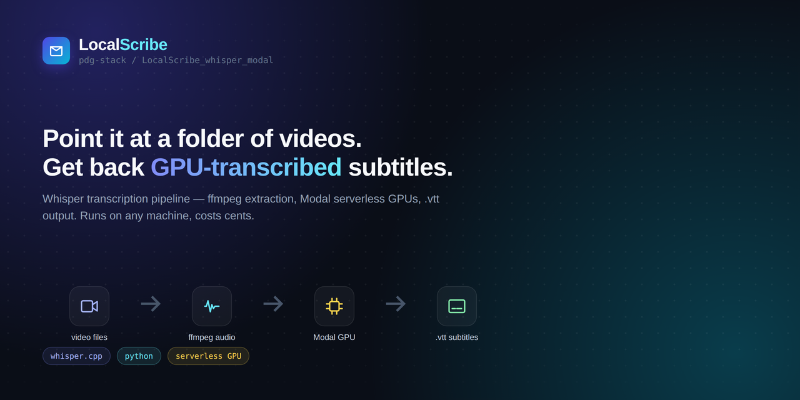

# LocalScribe_whisper_modal



A locally-hosted web app that scans a folder for audio/video files and
transcribes the ones you pick, using [faster-whisper](https://github.com/SYSTRAN/faster-whisper)
either on your own machine (CPU) or on [Modal.com](https://modal.com) GPUs.

## Features

- Point it at a folder; it scans recursively and shows video/audio counts,
  sizes, and durations both for that folder alone and including
  subfolders.
- Pick exactly which files to transcribe from a nested, accordion-driven
  selection table.
- Choose a Whisper model (`tiny` … `large-v3-turbo`), one or more output
  formats (`txt`, `srt`, `vtt`, `json`, `tsv`), and where it runs — your
  own CPU, or a Modal.com GPU.
- Preview estimated time/cost per phase before committing — estimates
  self-calibrate against your own machine's/GPU's real measured
  performance over time, not just a static guess.
- Run with a live progress bar, a per-phase status icon next to each row
  (spinner → green check, red cross, or yellow for a partial mix of
  success/failure), and a status log.
- **Cancel** interrupts the step currently in flight immediately, rather
  than waiting for the current file to finish.
- A diagnostics summary (real measured time/cost, not just the estimate)
  once a run finishes.
- Optionally deletes the intermediate audio file it extracts from video,
  never a file you already had — cleanup still runs even if a later
  phase failed or the job was cancelled.

## Setup

1. **Isolated virtual environment** (never install into system Python):

   ```bash
   uv venv --python 3.12 .venv
   ```

   Python 3.12 is pinned deliberately — `ctranslate2`/`faster-whisper`
   wheel availability for very recent Python releases isn't guaranteed,
   and `uv` will fetch 3.12 automatically if it isn't already installed.
   No `uv`? Use any Python 3.12 interpreter with `python -m venv .venv`
   instead.

2. **ffmpeg** must be on `PATH` (provides both `ffmpeg` and `ffprobe`).
   `scoop install ffmpeg`, `choco install ffmpeg`, or see
   [ffmpeg.org/download](https://ffmpeg.org/download.html).

3. **Install dependencies** into the venv:

   ```bash
   .venv\Scripts\activate
   pip install -r requirements.txt
   ```

4. **Run it**:

   ```bash
   uvicorn backend.main:app --reload
   ```

   Then open `http://localhost:8000`.

## Using it

1. Paste a folder path and click **Analyze**.
2. Pick a scope (current folder, or including subfolders) with the radio
   buttons, then expand Video/Audio to select individual files (or use
   the type-level checkbox to select all of that type at once).
3. Choose a model, output format(s), and execution (Local or Modal.com).
4. Click **Preview** to see estimated time/cost per phase, then **Begin**.
5. Watch progress; **Cancel** interrupts the step currently in flight
   immediately (it doesn't wait for the current file to finish) — Cleanup
   still runs afterward for any file that got an intermediate WAV
   extracted, so "Cancelling…" can take a few seconds to settle while that
   finishes.
6. Review the diagnostics summary once it's done.

Output files land next to the source file with the same base name (e.g.
`clip.mp4` → `clip.txt`, `clip.srt`, …). If "delete intermediate audio
files" is checked, the WAV extracted from a video file is removed once
transcription succeeds — an audio file you already had is never touched.

## Modal.com (optional GPU execution)

To run transcription on a Modal.com GPU instead of locally:

1. Sign up at [modal.com](https://modal.com) and create an API token at
   [modal.com/settings/tokens](https://modal.com/settings/tokens) — this
   gives you a **Token ID** and **Token Secret**.
2. In the app, select **Modal.com** as the execution mode, pick a GPU
   type (rates shown are approximate — verify current pricing at
   [modal.com/pricing](https://modal.com/pricing); **L4** is recommended
   as the best cost/throughput balance for Whisper inference), and paste
   in the Token ID/Secret.
3. Your Token ID/Secret are saved in `user_prefs.json` so you don't have
   to re-enter them each time. **This means they're stored in plaintext
   on your local disk.** The file is gitignored (never committed) and the
   credentials are never sent anywhere but Modal itself, but be aware of
   this if you share this machine or that file with anyone.

No prior `modal deploy` or `modal token set` is needed for the app itself
— it builds and runs an ephemeral Modal app per request using the
credentials you enter in the UI. (If you separately use the `modal` CLI
for other things, note that a manually-configured local profile is
overridden by whatever credentials the app sends for its own requests.)

Model weights are cached in a Modal Volume across runs, so only the
first Modal run for a given model size re-downloads it. Optionally, add
a [Hugging Face token](https://huggingface.co/settings/tokens) in the
Options panel (applies to both Local and Modal execution) to raise the
download rate limit for that first download — unauthenticated requests
are capped lower and can occasionally get rate-limited.

## Logs

Every transcription job writes a JSON-line log file to
`logs/<timestamp>_<short-job-id>.jsonl` (created at runtime, gitignored,
never committed), timestamped so the most recent run is easy to spot,
with full detail — including full tracebacks for failures — for
troubleshooting beyond the short, friendly message shown in the UI.

## Project structure

```text
backend/
  main.py            FastAPI app: serves frontend/, mounts the API
  scanner.py          recursive folder walk + classification
  ffmpeg_utils.py      locate ffmpeg/ffprobe, extract audio
  estimator.py         per-phase time/cost estimates
  pipeline.py           per-file orchestration (extract -> transcribe -> write -> cleanup)
  jobs.py                in-memory job registry + SSE event queue
  logging_utils.py        JSON-line job logs
  transcription/
    engine.py              local faster-whisper wrapper
    modal_app.py             Modal.com GPU execution
    writers.py                segments -> txt/srt/vtt/json/tsv
frontend/
  index.html, app.js, style.css   single-page UI, no build step
```

## License

MIT — see [LICENSE](LICENSE).
